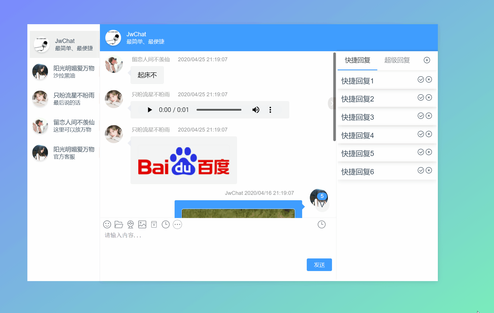

# JwChat

<!-- <p align="center">
  <a href="https://gitee.com/CodeGI/chat" rel="nofollow">
    
  </a>
</p> -->

#### 介绍

**一款基于 Vue 和 ElementPlus 的极简的聊天框组件**
本项目是一款极简的数据驱动为主的聊天框组件。
新增表情包可自动匹配微信表情。
新增聊天窗口配置组件，可以自由配置 顶部状态栏 和 右侧信息栏




#### 安装

建议您使用包管理器（如 NPM、Yarn 或 pnpm）安装 JwChat，

使用`npm`安装。

```bash
npm install jwchat
```

使用`yarn`安装。

```bash
yarn add jwchat
```

使用`pnpm`安装。

```bash
pnpm install jwchat
```

如果您的网络环境不好，建议使用相关镜像服务 cnpm 或 中国 NPM 镜像。

#### 使用

1. 在 `main.js` 中引入组件

```js
import JwChat from "jwchat";
import "jwchat/style.css";

app.use(JwChat);
```

2. 在 `*.vue` 中使用

```html
<JwChat
  :taleList="list"
  @enter="bindEnter"
  v-model="inputMsg"
  :showRightBox="true"
  scrollType="noscroll"
/>
```

#### 以文件的形式在本地直接引入

**请不要放在`public` 文件夹中。`import public` 文件夹中的文件中的 js，在打包时不参与编译会报错**

1. 将`lib`代码放在`/src/assets`文件夹中

2. 在 `main.ts` 中引入组件

```js
import JwChat from "./assets/lib/JwChat.es.js";
import "./assets/lib/style.css";

createApp(App).use(JwChat).mount("#app");
```

3. 在 `*.vue` 中使用

```html
<JwChat
  :taleList="list"
  @enter="bindEnter"
  v-model="inputMsg"
  :showRightBox="true"
  scrollType="noscroll"
/>
```

4. 如果项目使用的是`typescript` 需要在`src`目录下`*.d.ts`中声明类型。

```typescript
// env.d.ts 或者 vite-env.d.ts
declare module "*/JwChat.es.js";
```

#### 文档

- [**vue3 文档(2.\*.\*)**](https://chatv3-jwchat-2e2dd3dd9a6cd28b65a59e3f450f03cc4ca0ed9faff1a8252.gitlab.io)
- [**vue2 文档(1.\*.\*)**](https://chatv2-jwchat-c708817706894990ccfcbbc84e9d7e722741a4c12dcdad78f.gitlab.io)

#### 参与贡献

1.  Fork 本仓库
2.  新建 Feat_xxx 分支
3.  提交代码
4.  新建 Pull Request

#### 推荐项目

- [AVue](https://avuejs.com/)
- [JPower](https://gitee.com/gdzWork/JPower)

#### 交流学习

- QQ 群 ： 235689934 (已满)
- QQ 群 ： 791302027
