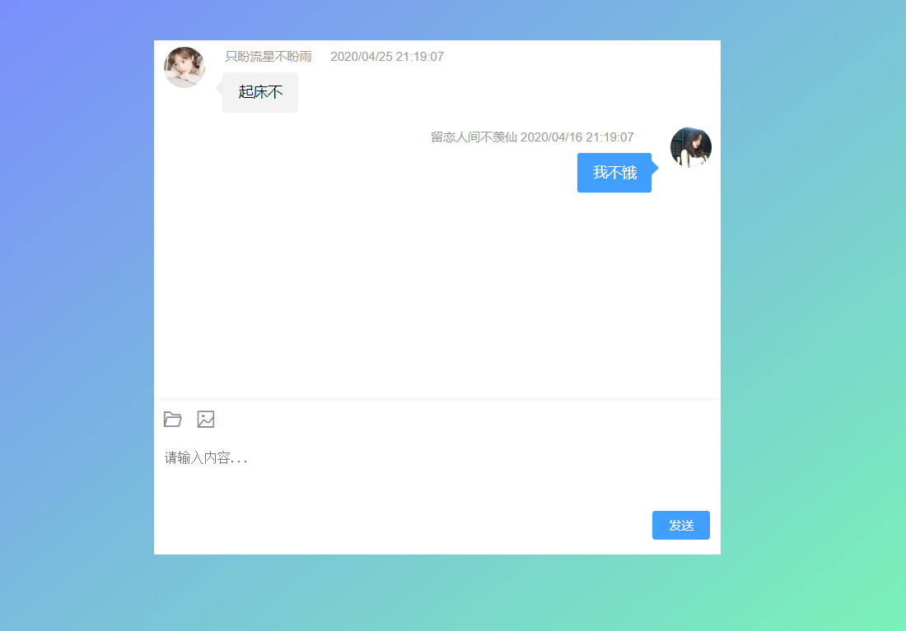

## 基本语法

``` xml
<JChat :taleList="taleList" @enter="bindEnter" v-model="inputMsg" :toolConfig="tool" />
```

会配置出一个 550*500 大小的窗口 如图：




## 参数配置

* `taleList[Array]` 需要渲染的会话数据

``` json
// 格式
[
    {
        "date": "2020/04/25 21:19:07",
        "text": { "text": "起床不" },
        "mine": false,
        "name": "只盼流星不盼雨",
        "img": "image/two.jpeg"
    },
    {
        "date": "2020/04/16 21:19:07",
        "text": { "text": "我不饿" },
        "mine": true,
        "name": "留恋人间不羡仙",
        "img": "image/three.jpeg"
    },
]

// data 用来展示时间数据
// text 用来展示本条会话内容
// mine 本条数据是否是我发的
// img 用户头像
```


* `@enter[Function]` 输入框点击就发送或者回车触发的事件

``` js
   bindEnter () {
        const msg = this.inputMsg
        if (!msg) return;
        const msgObj = {
          "date": "2020/05/20 23:19:07",
          "text": { "text": msg },
          "mine": true,
          "name": "JwChat",
          "img": "image/one.jpeg"
        }
        this.taleList.push(msgObj)
      },
```

* `toolConfig[Object]` 控制工具栏显示内容

``` js
{
    // file img video 现在只配置了三个图标
    show: ['file', 'img'],
    callback: this.toolEvent
}
    
 toolEvent (type/* 当前点击的按钮类型 */) {
     alert(type)
 }    
```

* `width` 和`height` 配置组件大小 默认 `550*500`

