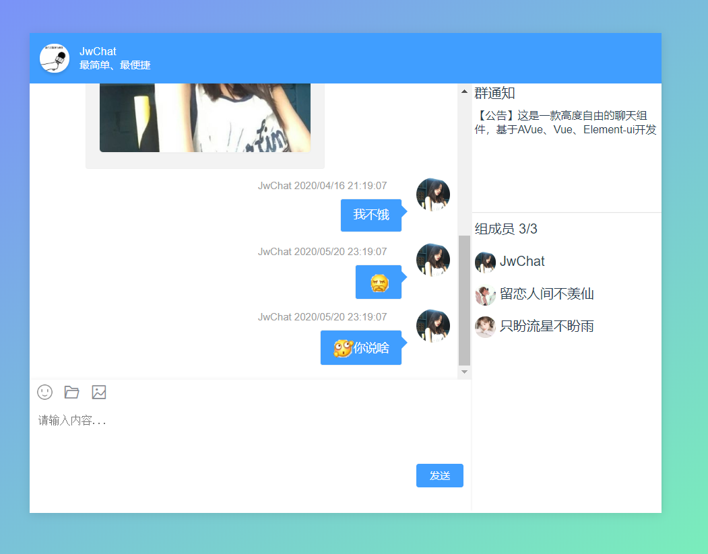

## 基本语法

---


``` xml
<JwChat-index :taleList="taleList" @enter="bindEnter" v-model="inputMsg" :toolConfig="tool" />
```




## 参数配置

---

### Attribute

| 参数       | 说明             | 类型   | 可选值 | 默认值 |
| ---------- | :--------------- | ------ | ------ | ------ |
| v-model    | 输入框中的文字   | String | -      | ""     |
| taleList   | 会话内容         | Array  | -      | []     |
| toolConfig | 工具烂配置       | Object | -      | {}     |
| width      | JwChat界面框宽度 | string | -      | 750px  |
| height     | JwChat界面框高度 | string | -      | 570px  |

### Methods

| 参数  | 说明                               | 参数           |
| ----- | ---------------------------------- | -------------- |
| enter | 输入框点击就发送或者回车触发的事件 | 输入框中的文字 |
|       |                                    |                |

###  Slot

| name   | 说明           |
| ------ | -------------- |
| header | 头部自定义插槽 |
| -      | 右侧自定义插槽 |


*  ####  `taleList`


``` json
// 格式
[
    {
        "date": "2020/04/25 21:19:07",
        "text": { "text": "起床不" },
        "mine": false,
        "name": "只盼流星不盼雨",
        "img": "image/two.jpeg"
    },
    {
        "date": "2020/04/16 21:19:07",
        "text": { "text": "我不饿" },
        "mine": true,
        "name": "留恋人间不羡仙",
        "img": "image/three.jpeg"
    },
]

// data 用来展示时间数据
// text 用来展示本条会话内容
// mine 本条数据是否是我发的
// img 用户头像
```

* #### `toolConfig` 

``` js
{
    // file img video 现在只配置了三个图标
    show: ['file', 'img'],
    callback: this.toolEvent
}
    
 toolEvent (type/* 当前点击的按钮类型 */) {
     alert(type)
 }    
```
